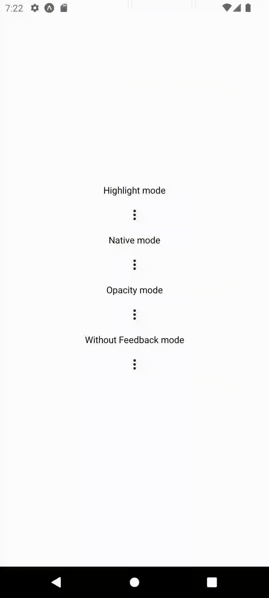

# react-native-android-popup-menu

A simple popup menu for React Native android apps. 



## Installation

```sh
npm install react-native-android-popup-menu
```
or
```sh
yarn add react-native-android-popup-menu
```

## Usage

```js
import PopupMenu from 'react-native-android-popup-menu';

export default function MyApp() {
  // ...
  const onSelectItem = (item, index) => {
    if (item === "itemSelected") {
      console.log("selected item:", index);
    }
  };
  
  const options = [
    "Edit",
    "Delete"
  ];
  
  return (
    // ...
    <PopupMenu
      onPress={onSelectItem}
      items={options}
    />
  );
}
```

## Options

| Key            | Type                                                                | Required | Default Value   |
|----------------|---------------------------------------------------------------------|----------|-----------------|
| onPress        | (event: PopupEvent \| string, index: number \| undefined) => void   | True     | undefined       |
| items          | string[]                                                            | True     | undefined       |
| mode           | ModeOption                                                          | False    | highlight       |
| icon           | MaterialIcons.glyphMap                                              | False    | more-vert       |
| iconSize       | number                                                              | False    | 24              |
| iconComponent  | ({ iconRef, ...props }) => React.ReactNode                          | False    | undefined       |
| iconColor      | ColorValue                                                          | False    | #222222         |
| underlayColor  | ColorValue                                                          | False    | rgba(0,0,0,0.2) |
| containerStyle | StyleProp\<ViewStyle\>                                              | False    | undefined       |
| buttonStyle    | StyleProp\<ViewStyle\>                                              | False    | undefined       |
| iconStyle      | StyleProp\<TextStyle\>                                              | False    | undefined       |

## Types

**ModeOption**
```ts
export type ModeOption =
  | 'opacity'
  | 'highlight'
  | 'without-feedback'
  | 'native';
```

**PopupEvent**
```ts
export type PopupEvent = 'dismissed' | 'itemSelected';
```

## Contributing

See the [contributing guide](CONTRIBUTING.md) to learn how to contribute to the repository and the development workflow.

## License

MIT

---

Made with [create-react-native-library](https://github.com/callstack/react-native-builder-bob)
